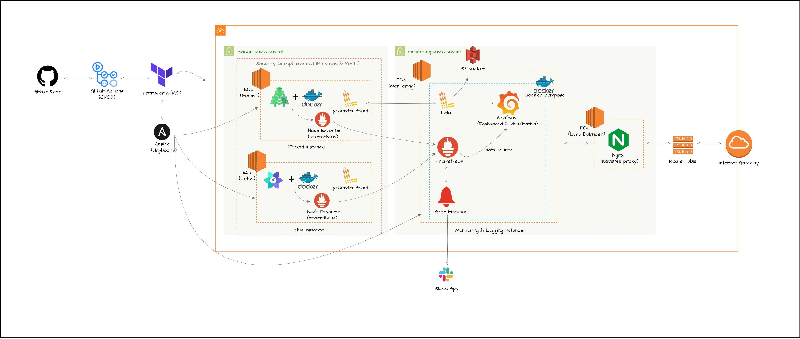

# Filecoin Nodes (Forest & Node) Infrastructure

This repository hosts configurations tailored for deploying Filecoin Forest and Lotus calibnet nodes on AWS Cloud infrastructure. The configurations prioritize essential aspects such as storage optimization, availability, monitoring setup, and security measures.

# Infrastructure Overview
The major components include:

- *AWS Cloud:* This forms the backbone of our infrastructure, managing EC2 server deployments for all our services and applications, including VPC networking, subnet configurations, and security groups.
  
- *Terraform:* Terraform serves as our Infrastructure As Code tool, enabling us to define and provision infrastructure resources across the AWS cloud provider, ensuring consistency and repeatability in our deployments.

- *Ansible:* With Ansible, we automate configuration management, application deployment, and task orchestration, streamlining our operations for the various Filecoin Nodes (Forest & Lotus) and the monitoring and reverse proxy instances (Prometheus,Loki, Grafana, Alertmanager, Nginx) ensuring the consistency and reliability of our systems.

- *Docker:* Docker allows us to run our containerized applications, providing a consistent environment across different platforms and simplifying the process of building and running applications. Docker-compose is employed to streamline the management of multi-container monitoring nodes (Prometheus,Loki, Grafana, Alertmanager) simplifying the orchestration and deployment processes.

- *Slack:* Slack: We utilize Slack for collecting Alertmanager alerts and sending them to a designated Slack channel based on our EC2 server metrics.

## Continous Integration

Our continuous integration (CI) process is powered by GitHub Actions, providing automation and integration for both Terraform processes related to infrastructure management and Ansible for configuration management and application deployment. The pipeline is initiated automatically upon pushes to the main branch, ensuring that changes to our codebase are swiftly incorporated into our deployment workflow.

# How To Setup And Deploy The Infrastructure?

## Requirements
- AWS EC2 Server: 
  - 8GB RAM, 2-core CPU, 128GB SSD (Forest Minimal)
  - 32GB RAM, 8-core CPU, 512GB SSD (Lotus Minimal)
  - 4GB RAM, 2-core CPU, *SSD (Monitoring Nodes)
  - EC2 Key-pair `.pem` (allow SSH into the instances) 
- Terraform 
- Ansible 
- Python 3.9+ (for ansible)

## Steps
**⚠️** Make sure to setup your AWS credentials:  
       Run `aws configure` to initialize `AWS_ACCESS_KEY_ID` & `AWS_SECRET_ACCESS_KEY`  

create `terraform.tfvars` file in `/terraform` directory for terraform variables   
      
      [file sample: terraform.tfvars]

      aws-region           = "<your-region>"
      azs                  = <["your-avail-zone1", "your-avail-zone1", "your-avail-zone1"]>
      ssh-private-key-path = "</path/to/keys/yourfile.pem>"
      key-name             = "<name-of-ssh-key>"
      ssh-user             = "<ssh-user>"
      slack-webhook        = "<your-slack-app-webhook-url>" 

### With `Make`

- State-Backend Setup:  
      Run `make state-backend`

> **⚠️_Note:_** To maintain the uniqueness of the state bucket, if you encounter an error indicating that the bucket already exists, update the bucket value in the `terraform/backend/backend.tf` file.

- Infrastructure Initialization, Setup & ansible installations:  
      Run `make setup-infra`

*use `make help` make usage and description*

### check states and connection of Filecoin Nodes on the Calibration Network (calibnet)
To do this we have to SSH into the instances

- Forest Instance  
  Run `ssh -i /path/to/your/private-key.pem ec2-user@your-instance-public-ip`   
  Run `docker exec -it forest forest-cli net peers`
 

- Lotus Instance  
  SSH into the instance  
  Run `docker exec -it lotus lotus net peers` 

## Monitoring & Logging

The monitoring nodes are automatically configured with ansible to connect to its designated endpoints and servers
- `Prometheus` gets `Forest Instance` and `Lotus Instance` server metrices from `Node exporter` installed and configured on the respective instances
- `Loki` gets all system logs from `promtail` installed and configured on the `Forest` and `Lotus` instance
- `Alertmanager` get alerts triggered from `Prometheus` to send to a `slack` channel based on the config  
The slack channel name and other configs can be modified in the `ansible/alertmanager/alertmanager-config.yaml.j2` config file.

- `Prometheus` & `Loki` are setup as data sources in `grafana`
- `Nginx` is setup and configured as a reverse proxy pointing to the grafana endpoint
  
### Setup Dashboard 
You can access the Grafana node by directing traffic to the nginx endpoint, which then routes the traffic to the Grafana endpoint.
- browser: `nginx-ip:3000` (get ip from terraform outputs)
- default authentication: username & Pass - `admin` 

- navigate to import a new dashboard and paste the .json file content of upload template file  
      - json file: [Dashboard Template for Metrics & Logs](assets/Filecoin-Nodes-Metrics-1715558167091.json)  
  
⚠️ The template was created specifically for Metrics & Logs of the Filecoin Forest and lotus Instances.